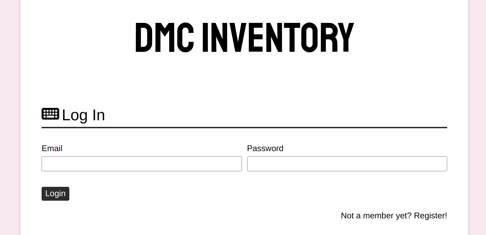
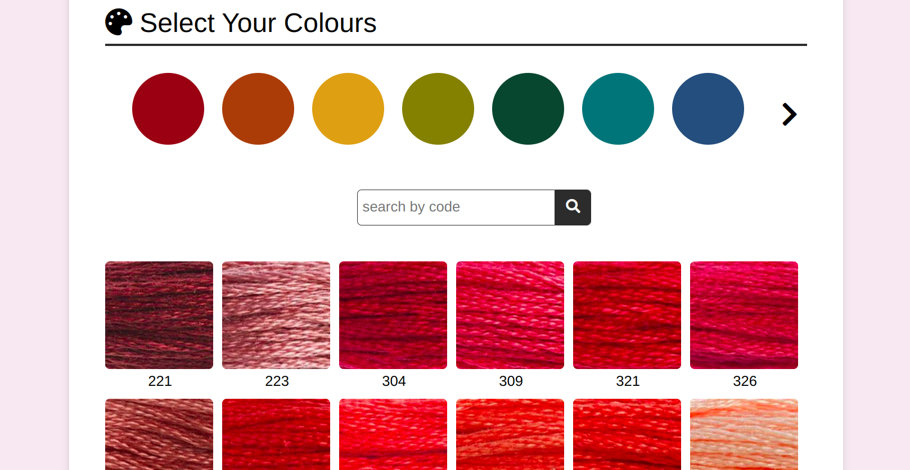
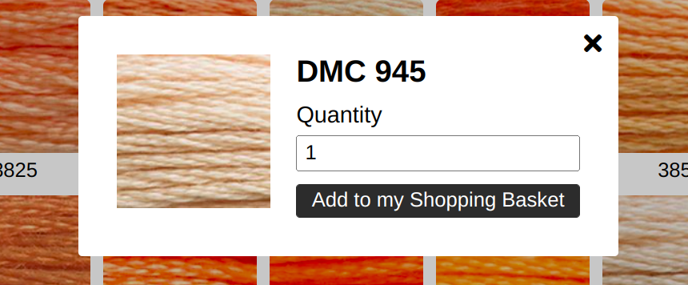
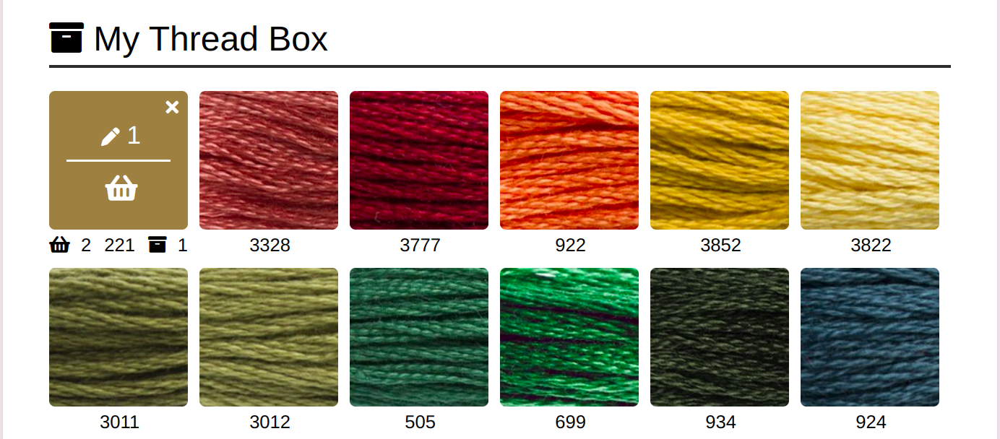
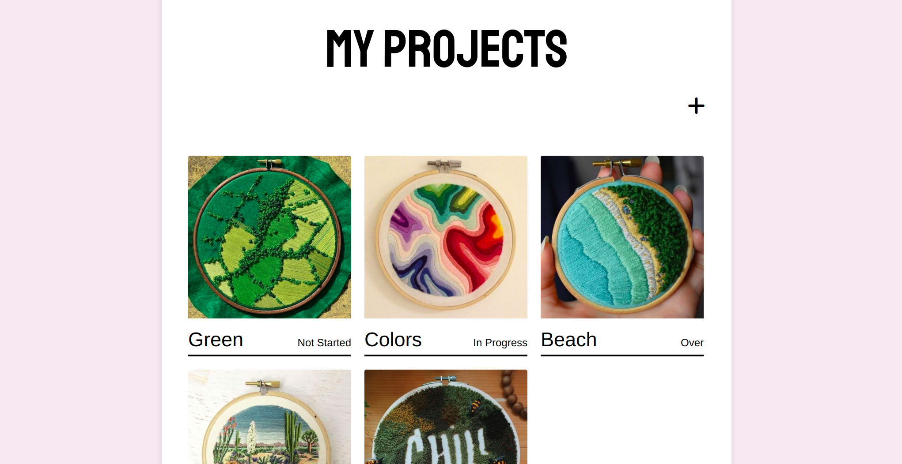
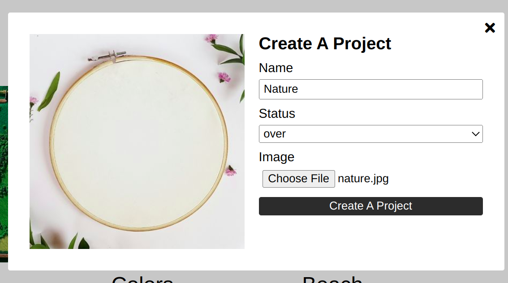
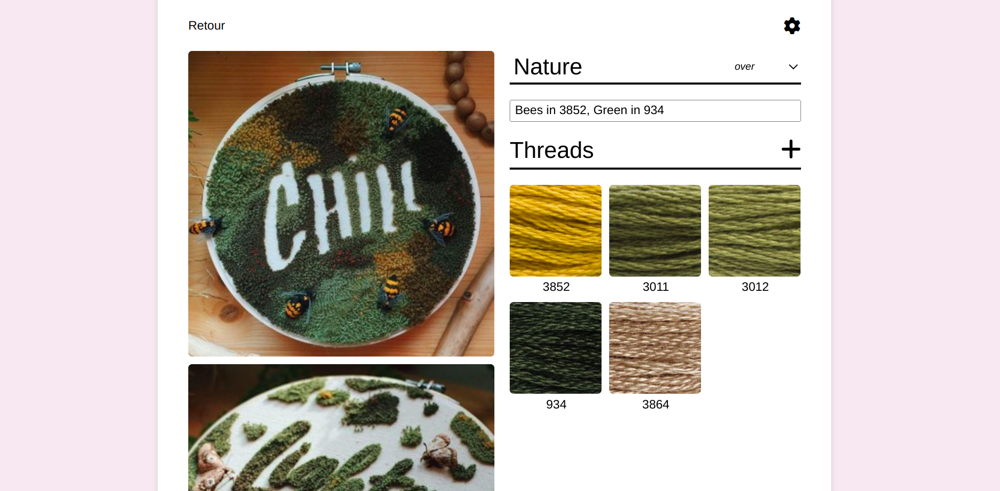

  

# Embroide me - Embroidery Stash Application

## Description
Browse and store your favorite colors of thread for your embroidery projects !
(Images from the treads store DMC)

https://embroidery-app.onrender.com

## Technologies
Javascript, Node.js, Express, Mongo DB

## Test account
Want to do a little tour of the app ? Log in with this logs :
> ID : test@gmail.com
> PW : Test1234

## Presentation

### Login - Register

You can log in or register from the index page. It gives you access to the rest of the app.

### Inventory page

#### Browse threads

On the inventory page, you can browse for new threads, by color or code, to add them into you shopping list or your personal inventory. You need to specidy the quantity of threads you want to add. 

#### Shopping list and personal inventory

On the inventory page, you can also see your shopping list and your personal inventory. When you hover on any thread (in the browser too), you can see if you already stored the tread in you shopping list or you personnal inventory. You can modify the quantity of the selected thread, and add it to an other storage.

### Projects page

The projects page allows you to display your emboidery's projects and add new ones !

### Details of a project

You can click on any project and land on the page of the project to see more images, and threads assigned to the project. You can browse threads from the project page, add new images, more info to the description, change the state of the project and delete the project.

